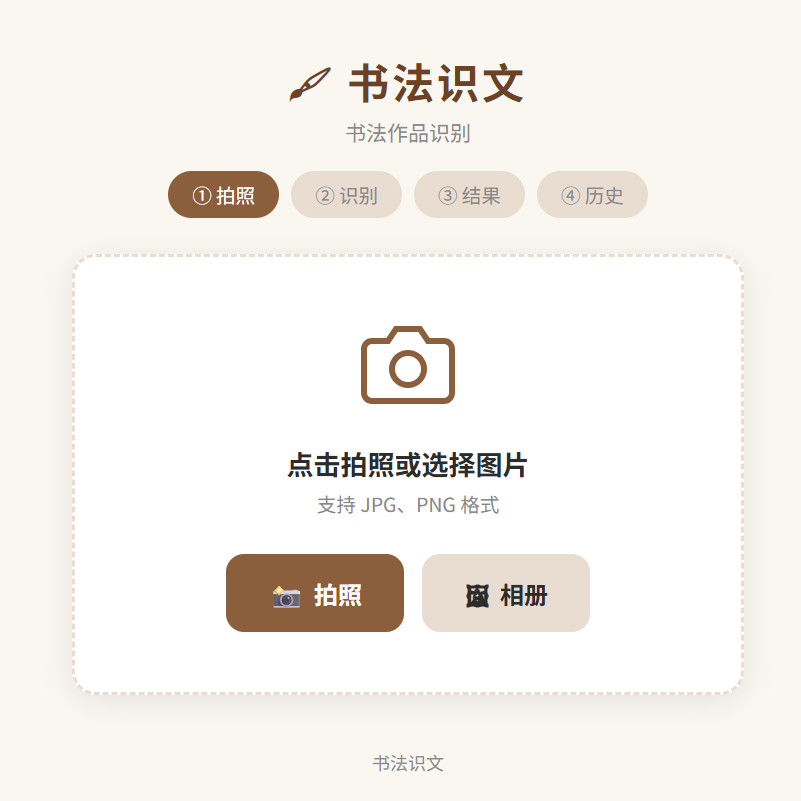
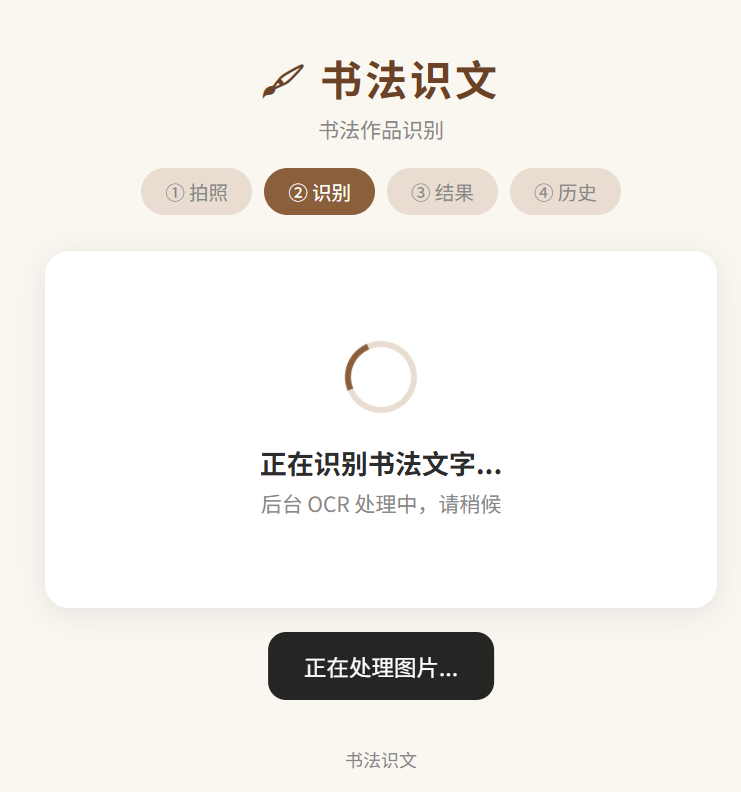
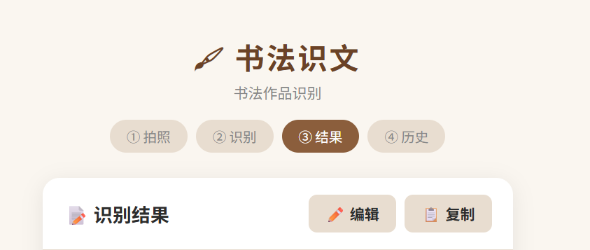
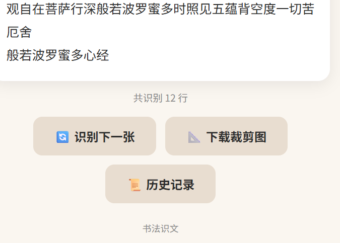

# 书法识文

书法作品识别与整理辅助工具。项目面向书法图片的数字化整理场景：上传作品照片，自动压缩并提交到后端 OCR，返回可编辑、可复制、可保存到本地历史的识别文本。

当前版本定位为 **桌面浏览器优先的实验型 OCR 工具**。电脑端 Chrome / Edge 已可用；手机端受 GitHub Pages PWA 缓存、移动浏览器上传行为和 Render 免费后端冷启动影响，暂不作为稳定使用场景。

- 在线前端：[https://h-wren.github.io/Calligraphy/](https://h-wren.github.io/Calligraphy/)
- 后端健康检查：[https://calligraphy-api-7cs2.onrender.com/health](https://calligraphy-api-7cs2.onrender.com/health)
- 仓库：[https://github.com/H-Wren/Calligraphy](https://github.com/H-Wren/Calligraphy)



## 项目定位

这个项目不是通用 OCR 产品，而是一个围绕书法作品整理流程的小型工具原型：

- 帮助把书法作品照片转成可编辑文本
- 辅助建立作品文字记录、检索材料和档案条目
- 验证传统书法内容数字化整理的交互流程
- 为个人网站、作品档案和后续数据整理提供基础能力

识别结果仍需要人工校对。书法字体、拍摄角度、纸张反光、印章和落款都会影响 OCR 质量。

## 当前状态

| 能力 | 状态 |
| --- | --- |
| 桌面端上传图片 | 可用 |
| 桌面端 OCR 识别 | 可用 |
| 结果编辑、复制 | 可用 |
| 本地历史记录 | 可用 |
| 自动裁剪/背景白化 | 实验性 |
| 手机端 Safari / Edge | 不稳定，暂不推荐 |
| 免费 Render 后端 | 可运行，但有冷启动和偶发连接中断 |

## 功能

- 上传或拍摄书法作品图片
- 前端自动压缩图片，降低上传体积
- 后端异步 OCR：提交后返回任务 ID，前端轮询识别结果
- 识别文本可编辑、复制
- 识别结果保存到浏览器本地历史
- 支持裁剪与背景白化接口
- GitHub Pages 静态前端 + Render Docker 后端部署

## 效果预览

| 识别中 | 结果页 | 识别文本 |
| --- | --- | --- |
|  |  |  |

## 技术栈

- 前端：HTML、CSS、原生 JavaScript、PWA Service Worker
- 后端：Python、FastAPI、Uvicorn
- OCR：RapidOCR、ONNX Runtime
- 图像处理：OpenCV、Pillow
- 部署：GitHub Pages、Render Docker

## 架构

```text
Browser / GitHub Pages
        |
        | POST /api/recognize
        v
FastAPI on Render
        |
        | background OCR job
        v
RapidOCR + ONNX Runtime
        |
        | GET /api/recognize/{job_id}
        v
Editable result in browser
```

识别接口采用后台任务方式，避免 Render 免费实例在单次长请求中被代理层断开。

## 项目结构

```text
Calligraphy/
├── backend/
│   ├── main.py                # FastAPI API 与后台任务
│   ├── requirements.txt       # Python 依赖
│   ├── Dockerfile             # Render Docker 构建
│   └── services/
│       ├── image_processor.py # 裁剪与背景白化
│       └── ocr_service.py     # RapidOCR 识别服务
├── frontend/
│   ├── index.html
│   ├── style.css
│   ├── app.js
│   ├── config.js              # 线上 API 地址
│   ├── manifest.json
│   └── sw.js
├── docs/
│   ├── images/                # README 图片
│   └── website-copy.md        # 个人网站项目文案
├── docker-compose.yml
├── render.yaml
└── DEPLOYMENT.md
```

## 本地运行

建议使用 Python 3.10。

### 启动后端

```powershell
cd backend
pip install -r requirements.txt
python main.py
```

默认地址：

```text
http://localhost:8000
```

### 打开前端

直接打开：

```text
frontend/index.html
```

或启动静态服务：

```powershell
python -m http.server 8080
```

然后访问：

```text
http://localhost:8080/frontend/
```

本地开发时，如需改 API 地址，可编辑：

```text
frontend/config.js
```

## API

| 方法 | 路径 | 说明 |
| --- | --- | --- |
| `GET` | `/health` | 健康检查 |
| `POST` | `/api/recognize` | 上传图片，创建 OCR 任务 |
| `GET` | `/api/recognize/{job_id}` | 查询 OCR 任务结果 |
| `POST` | `/api/crop-image` | 上传图片，返回裁剪和背景白化结果 |

## 部署说明

前端部署在 GitHub Pages 的 `gh-pages` 分支；后端部署在 Render 的免费 Docker Web Service。完整部署流程见 [DEPLOYMENT.md](DEPLOYMENT.md)。

## 已知限制

- 手机端暂不作为稳定使用场景。
- Render 免费实例会休眠，首次请求可能较慢。
- OCR 模型对书法字体的识别并不稳定，结果需要人工校对。
- 浏览器历史记录只保存在本机 `localStorage`，不会同步。
- 上传图片会写入后端 `uploads/`，公开部署时应定期清理或改造为临时存储。

## 后续方向

- 提供更稳定的后端部署环境
- 支持批量上传和批量导出
- 增加作品元数据字段：作者、年代、尺寸、释文、备注
- 改善手机端上传和缓存体验
- 为个人作品档案网站提供嵌入式入口
